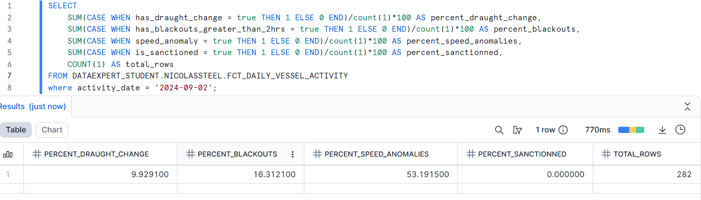
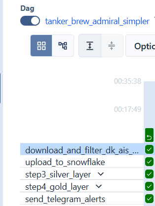
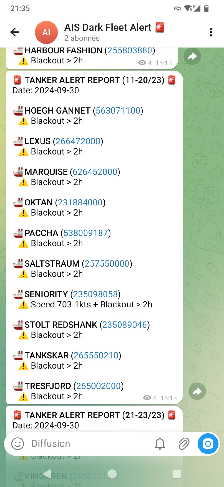

NOTE : TO BE UPDATED BEFORE IT COMES FROM ANOTHER PROJECT FROM DATAEXPERT.IO BASE REPOSITORY

# Tanker Tracker Admiral (Capstone Project)

## Overview
**Tanker Tracker Admiral** is a data engineering capstone project designed to monitor global energy flows and detect "Dark Fleet" patterns (sanctioned vessels illicitly transporting oil).
It ingests massive AIS (Automatic Identification System) logs from the Danish Maritime Authority, filters them for tankers, and leverages **Snowflake** and **dbt** for analysis and risk detection.

## Issues
API for both AIS and sanction Data cost some money (thousand dollars per month), so I had to use free historical data. It's possible however to finance this project and use streaming data, thus increasing the value of the project. Logic would be the same, but with the addition of a streaming storage layer (like **Kafka** or **Pulsar**). DBT would be triggered at the end of the day for the final calculations.

## Key Capabilities
- **Local Ingestion**: Filters terabytes of raw AIS logs to extract only Tanker data (cutting volume by 90%).
- **dbt Transformation Pipeline**: 
  - **Bronze**: Raw AIS data + Sanctions lists.
  - **Silver** (`int_ais_trajectories`): Trajectory reconstruction, speed calculation, geofencing (DK Zone).
  - **Gold** (`fct_daily_vessel_activity`): Daily aggregation of vessel activities, flag changes, and risk indicators.
- **Risk Detection**: 
  - **Sanctions Screening**: Cross-references vessels with OFAC/EU sanctions lists.
  - **Speed Anomalies**: Detects impossible speeds (potential spoofing) or suspicious slowdowns.
  - **Blackout Detection**: Identifies AIS signal gaps > 2 hours.
  - **Draught Change**: Monitors loading/unloading events at sea.
- **Alerting**: Sends consolidated daily reports via **Telegram** for immediate actionable intel.

## Metrics results

For daily data (2024-09-02):

- Download raw data : 800MB
- After filtering for tankers, bronze table (DK_AIS_BRONZE): 95MB
- Silver table (int_ais_trajectories): 120MB [enrichment]
- final table (fct_daily_vessel_activity) : 14KB [aggregation]



For this day, 9% of vessels have draught chance, 53% has speed anomaly, 16% have blackouts and none appear in sanction lists.

A high number of speed anomalies could indicate GPS spoofing, which is a tactic used by "Dark Fleet" vessels to evade detection. This may could also be due to GPS errors, so it's really important to double check the vessels detected by out system before taking any action (e.g. contacting the vessel before sending coast guard / fines), and maybe add a "confidence score" to the alerts.

For this POC, I'm not double checking the vessels with cross-references. In production, I would cross-reference with for example satellite imagery, other AIS providers, etc. to confirm the findings.

## Architecture

```mermaid
graph LR
    DMA[Danish Maritime Authority] -->|Ingestion Script| Local[Local CSV (Tankers only)]
    Local -->|Snowpark Upload| Bronze[Snowflake Bronze]
    Sanctions[Sanctions List] -->|Snowpark Upload| Bronze
    
    subgraph Snowflake & dbt
        Bronze -->|dbt Build| Silver[Silver Layer]
        Silver -->|dbt Build| Gold[Gold Layer]
    end
    
    Gold -->|Python Operator| Telegram[Telegram Alerts]

    subgraph Orchestration [Airflow (Cosmos)]
        Ingestion --> Upload --> dbt_Silver --> dbt_Gold --> Alerting
    end
```

## Data Pipeline Layers

### 1. Ingestion (Local)
- **Source**: Danish Maritime Authority (Daily Zip Files).
- **Script**: `dk_ingestion.py`
- **Logic**: Downloads daily Zip, streams content, filters for `Ship type == Tanker`.

### 2. Bronze Layer (Snowflake)
- **Tables**: `DK_AIS_BRONZE` (AIS data), `SANCTIONS_LIST` (OFAC/EU).
- **Loader**: `snowpark/load_to_snowflake.py`.

### 3. Silver Layer (dbt)
- **Model**: `int_ais_trajectories`
- **Logic**: 
  - Reconstructs vessel trajectories (Lead/Lag analysis).
  - Calculates distance (`haversine`) and time deltas.
  - Computes speed (Knots).
  - Filters for data within the Danish Exclusive Economic Zone (EEZ).

### 4. Gold Layer (dbt)
- **Model**: `fct_daily_vessel_activity`
- **Logic**:
  - Aggregates activity per vessel/day.
  - Flags: `is_sanctioned`, `has_blackout`, `speed_anomaly`.
  - Strategy: Incremental (`delete+insert`) to ensure idempotency.

### 5. Alerting
- **Channel**: Telegram.
- **Script**: `alerting/send_telegram_alerts.py`
- **Features**: Batched messages to respect API limits, HTML formatting for readability.

## Key Metrics & KPIs Tracked
To effectively monitor and classify "Dark Fleet" behavior, the Gold layer (`fct_daily_vessel_activity`) calculates and flags the following KPIs per vessel per day:

1. **Sanctions Hits (`is_sanctioned`)**: 
   - **Metric**: Boolean flag if `MMSI` matches the active OFAC/EU sanctions registry.
   - **Business Value**: Immediate compliance breach detection.
2. **Speed Anomalies (`speed_anomaly`)**: 
   - **Metric**: Sustained speeds > 40 knots or impossible geospatial jumps between points.
   - **Business Value**: Indicates GPS spoofing (vessel broadcasting false coordinates) or data tampering.
3. **AIS Blackouts (`has_blackout`)**: 
   - **Metric**: Time gaps > 2 hours between consecutive AIS signals.
   - **Business Value**: "Going dark" is the primary tactic used during illicit Ship-To-Ship (STS) transfers.
4. **AIS draught changes (`draught_change`)**: 
   - **Metric**: Draught changes > 0.5 during a day.
   - **Business Value**: Indicates loading/unloading events at sea.
*![Placeholder: Insert screenshot of Snowflake Dashboard or dbt tests showing these KPIs]*

## Deployment Strategy

The project utilizes a modern, decoupled data stack deployed via **Astronomer (Astro CLI)** for containerized Airflow.

### High-Level Deployment
1. **Orchestration**: Airflow (via Astro) runs in isolated Docker containers (`Postgres`, `Scheduler`, `Triggerer`, `Webserver`).
2. **Transformation Engine**: dbt runs within the Airflow task groups using the **Cosmos** library, which translates dbt nodes into Airflow tasks natively.
3. **Compute**: All heavy lifting (Bronze parsing, Silver/Gold aggregations) is pushed down to **Snowflake's** cloud warehouses, meaning the Airflow workers only handle HTTP requests and metadata.



### CI/CD & Production Path
For a true production deployment (beyond local `astro dev`):
- **Code**: GitHub Actions pushes merged code to an Astronomer Software deployment.
- **dbt**: `dbt build` is handled dynamically by Cosmos in production, using environment secrets supplied by Astronomer environment variables.
- **Snowflake**: Roles and tables are managed via Terraform or dbt grants (currently implemented via `ddl.sql` and Snowpark).


## Setup & Usage

### Prerequisites
- **Astro CLI** (running local Airflow in Docker).
- **Snowflake Account** (credentials in `.env` or Airflow Connection).
- **Telegram Bot Token** (for alerts).
- **rsa key** (make sure your `rsa_key.p8` is at the root of project).
- **integration to `airflow-dbt-project`** (put the `capstone_tanker_Tracker_admiral` folder in the root of `airflow-dbt-project`)

### Environment Variables
Create a `.env` file in the project root:
```ini
SNOWFLAKE_ACCOUNT=...
SNOWFLAKE_USER=...
SNOWFLAKE_PASSWORD=...
SNOWFLAKE_DATABASE=DATAEXPERT_STUDENT
SNOWFLAKE_SCHEMA=...
SNOWFLAKE_WAREHOUSE=...
TELEGRAM_BOT_TOKEN=...
TELEGRAM_CHAT_ID=...
```

### Running the Pipeline
The pipeline is orchestrated by the DAG **`tanker_Tracker_admiral_simpler`**.

1. **Start Airflow**:
   ```bash
   astro dev start
   ```
2. **Trigger DAG**:
   - Go to `localhost:8080`.
   - Enable and trigger `tanker_Tracker_admiral_simpler`.
   - The DAG handles backfills with dbt, idempotency is handled.

### dbt Development
Models are located in `dbt_project`.
To run dbt manually (from inside the Astro environment or with local vars):
```bash
cd dbt_project
dbt build --select +fct_daily_vessel_activity
```

## Project Structure
- `dags/`: Airflow DAG definitions.
- ``:
    - `dk_ingestion.py`: download and filter AIS data (locally).
    - `dbt_project/`: dbt models, macros, seeds.
    - `alerting/`: Alerting script.
    - `snowpark/`: Snowflake loading scripts.
